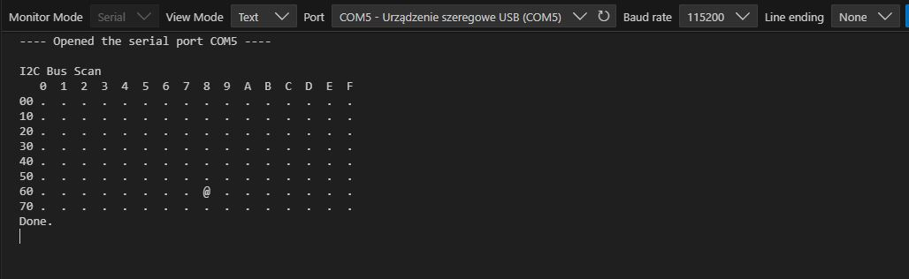

# Raspberry Pico I2C bus scan

A simple application that scans the I2C bus for connected devices.

The U2F directory contains a compiled, ready-to-upload firmware for the Raspberry Pico. The main directory includes the C program, which is ready for compilation.

After flashing the firmware, the microcontroller restarts and performs a scan after 5 seconds. The results are displayed on the console. Connection parameters: 115200,8,n,1. The microcontroller is connected via USB. If it is not detected by Windows, you may need to install the driver.

In the attached screenshot, the RTC DS3231 module is detected. This program is part of a larger project, and I will be adding more components here as time allows.
